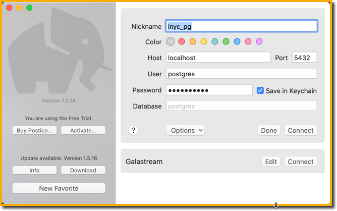
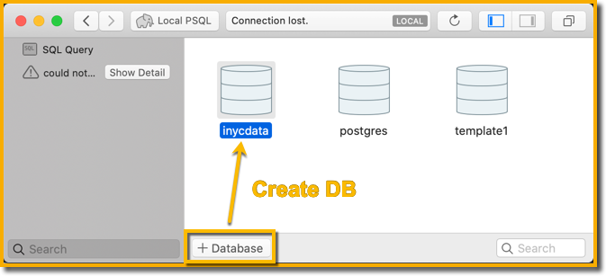
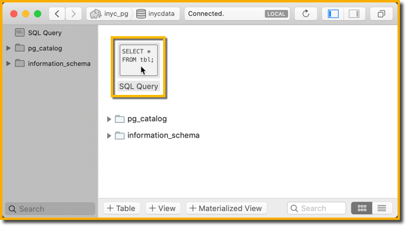
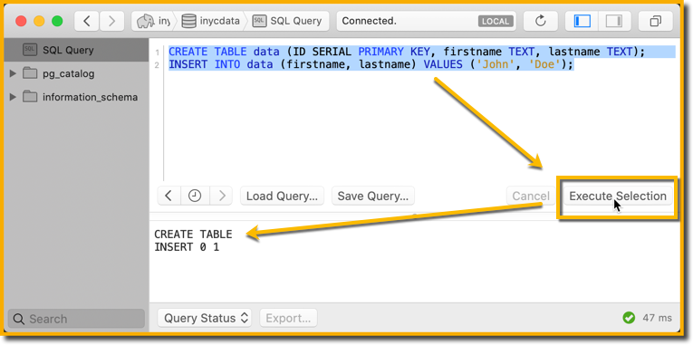

# version 0.1 alpha

## in VSCode, preview this README with images by pressing [ CMD-SHIFT-V ]
...

# Run command:

    docker-compose up --build

# Create PG DB with Postico

Download Postico and connect to localhost as postgres/postgres.

https://eggerapps.at/postico/

# Create a table and populate it with data using Postico

Run SQL Query

Run these two lines to create a table and add one record:

    CREATE TABLE data (ID SERIAL PRIMARY KEY, firstname TEXT, lastname TEXT);
    INSERT INTO data (firstname, lastname) VALUES ('John', 'Doe');

Select both lines and click the Execute Selection button:

